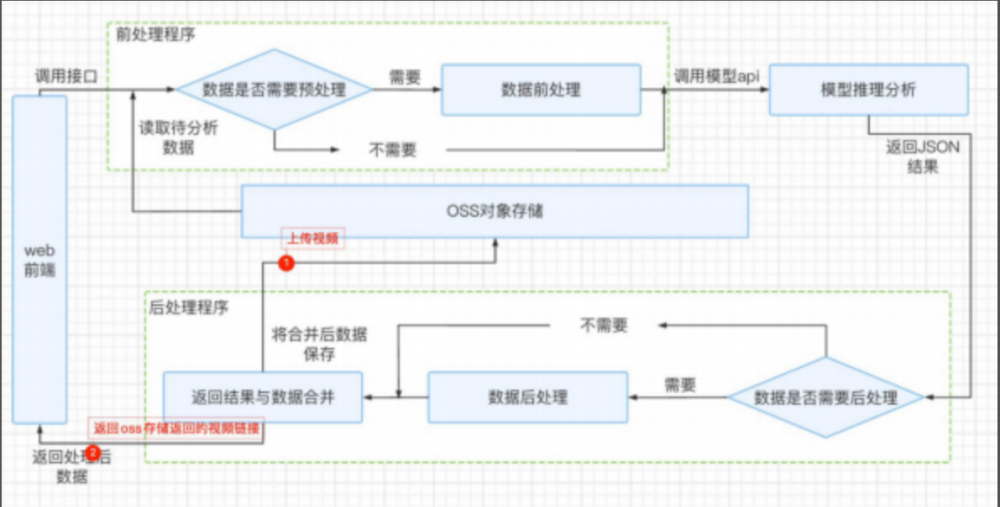

# 微表情识别API系统

> 该项目只开源前后端程序，模型不开源

## 更新功能

### 4.1版本
1. 改用epoll实现IO多路复用并发服务器
2. 去除标志位设定---正在考虑用协议实现

## 项目介绍

本项目用于检测并识别视频中人脸的微表情

### 目标任务:

1. 用户上传一段人脸视频

   

2. 合成可以播放的处理后HLS视频流文件，用户可下载

   

   

### 演示视频：
https://www.bilibili.com/video/BV13u4y1C7ZT/


<video width="320" height="240" controls>
  <source src="img/output_oss_30s.mp4" type="video/mp4">
</video>

## 项目架构

### 总结构

#### c++版
开源和演示都是c++版


#### python版




### 前后处理模块

#### 版本1：linux的c++并发服务器项目

1. TCP套接字服务器
2. IO多路复用（select）实现并发

2. 指令上传下载视频
3. 文件传输设置开始结束标志位
4. 使用消息前缀传输数据，防止粘包
5. 子进程使用ffmpeg分块转成1s的ts流
6. 循环向API发送视频请求，处理json
7. 循环合成新视频


#### 版本2：python推流并发服务器

1. 前台：tornado并发服务器

2. 分块MP4---协程
3. 异步并发 发送API请求，处理json----asyncio

4. oss推流——阿里云oss服务


### API模块

#### 1.pytorch训练识别模型

##### 模型

双帧法 基于resnet的改进模型

##### 结果

在测试集上，模型达到了98%的准确率

##### 输入

一段1s视频

##### 输出

识别到的视频人物表情类别


#### 2.torchserve封装识别模型和检测模型

##### 检测模型

opencv的人脸检测模型

##### 输入

一段1s视频

##### 输出

识别到的类别和视频每一帧的识别人脸所在框组成的json字符串

```
#示例json
[
	[
	"surprise",
	[
		[136,503,87,454],
		[135,504,85,454],
		// other data...
	]
]
```


#### 3.在docker容器中部署组成微服务API

##### 运行环境

可以用GPU，也可以只用cpu

##### 端口

暴露端口：30088

映射到容器的端口：8080

##### 启动

```
torchserve --start --ncs --model-store model-store --models IDB-emo-video.mar

```


##### 测试API示例

```
D:\work\IDB-py3.9>curl http://127.0.0.1:30088/predictions/IDB-emo-video -T EP02_01f.avi
[
  "surprise",
  [
    [
      136,
      503,
      87,
      454
    ],
    [
      135,
      504,
      85,
      454
    ],
    [
      134,
      504,
      84,
      454
    ],
    // other data...
  ]
]
```


## C++并发服务器详细说明

### 文件结构

```
项目架构
lb@lb-xa:~/myProject/网编微表情识别API/服务端/4.0$ tree -L 2
.
├── data				---------用户上传文件保存位置
│   ├── 1.txt
│   ├── 2.txt
│   ├── final			---------用户原视频转HLS保存文件夹
│   ├── final.mp4		---------用户上传原视频
│   ├── other
│   ├── output_video	---------API合成HLS文件保存文件夹
│   └── test.txt
├── func				---------功能模块
│   ├── UpDownFile.cpp
│   └── VideoHandle.cpp
├── include				---------头文件
│   ├── myhead.h
│   ├── UpDownFile.h
│   └── VideoHandle.h
├── main				---------项目可执行文件
├── main.cpp			---------项目主入口文件
├── Makefile			---------makefile编译项目
├── output				---------编译中间生成文件
│   ├── func
│   ├── main.d
│   └── main.o
└── 说明文档.txt

8 directories, 15 files
```


### 实现功能

1. 指令上传下载

   ```
   上传:put file.txt
   下载:get file.txt
   ```

   

2. IO多路复用（select），高性能并发

   ```
   初始化：
       fd_set stFdr;              // 初始化表
       FD_ZERO(&stFdr);           // 全置0
       FD_SET(fd_Server, &stFdr); // 将服务器接受请求IO文件加入检测表
   检测：
       fd_set stFdrTmp = stFdr;// 缓存表，存放select每次返回的结果
       ret = select(max + 1, &stFdrTmp, NULL, NULL, NULL);
   循环条件处理：
   	if (FD_ISSET(i, &stFdrTmp))// 如果表中i位置为1，表示有客户端活跃
   ```

   

3. 自定义文件传输标志位，通知对方文件传输开始与结束

   ```
   STF：文件传输开始标志位
   EOF：文件传输结束标志位
   ```

   

4. 使用消息前缀（int），防止粘包

   ```
   12put file.txt3STF1024data...
   ```

   

5. 创建子进程处理视频

6. 子进程处理完任务发信号通知父进程回收资源，防止僵尸进程

   ```
   父进程：
   	// 注册回收信号并绑定回调处理函数
   	signal(SIGUSR1, signal_handler); 
   	
   子进程：
   	// 结束后，给父进程发送信号通知回收资源
   	kill(getppid(), SIGUSR1);
   
   ```

   

7. 将上传的视频处理成hls流媒体文件

   

   用户上传原视频文件

   

   转换HLS文件

   

   

   

8. 循环发送API请求（curl），携带ts文件

   

9. json+opencv库处理API返回结果，生成新的ts流文件

   

   


# 5.0版本【研发中】

### 功能

1. 添加数据库，上传指令先要带上上传文件的信息和一个key值，数据库保存文件上传者信息、key、视频位置

   ```
   put username key file.txt
   ```

2. 下载指令需要带上上传者用户和key,服务器验证完，再返回下载文件

   ```
   get username key file.txt
   ```

3. 采用生产者消费者架构模式，实现解耦

   - 线程1：循环发送视频请求，返回json结果加入队列
   - 线程2：循环从队列中拿取json，合成视频

4. 发送视频请求采用IO多路复用框架实现并发
